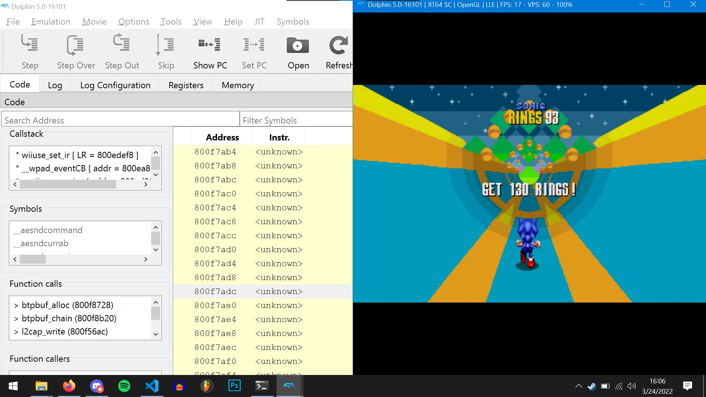
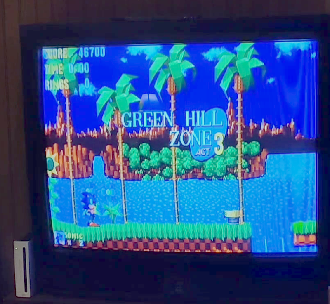

# RSDKv4 Wii

At one point, I attempted to [port a decompilation of the mobile remakes of Sonic the Hedgehog 1 and 2 to the Nintendo Wii](https://twitter.com/AmyWrightDev/status/1507133753788755970).

Check [here](https://twitter.com/AmyWrightDev/status/1507488292622663686) for a video of it in action!.